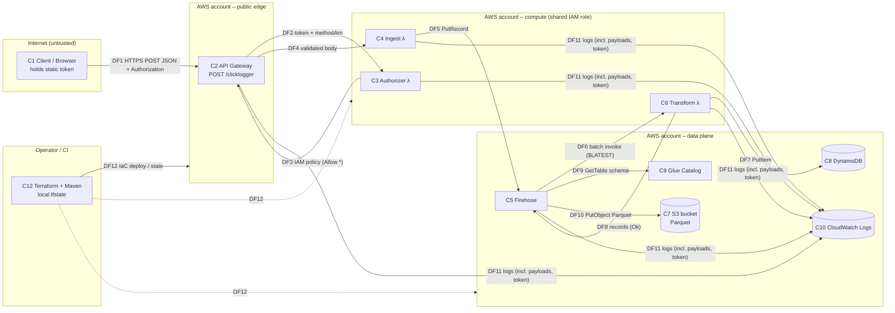

# Threat Model — Click Log Ingestion Pipeline (API Gateway → Lambda → Firehose → S3 / DynamoDB)

| | |
|---|---|
| **Scope** | Everything in this repository: `terraform/templates/*.tf`, `terraform/templates/Makefile`, `source/clicklogger` (Java 8 Lambdas) |
| **Method** | Data-flow decomposition + STRIDE per element, risk = Likelihood × Impact |
| **Baseline** | Commit `88fb8b6` (branch `claude/fervent-dirac-hd0xkc`) |
| **Date** | 2026-09-30 |
| **Status** | Initial model, built from the source code alone. No ThreatModeler project or platform configuration was used. |

---

## 1. System overview

Websites and apps POST user-interaction events ("click logs") to a public API Gateway REST endpoint. A Lambda **TOKEN authorizer** checks the `Authorization` header against a static allow-list. An **ingest Lambda** forwards the event to a **Kinesis Data Firehose** delivery stream. Firehose calls a **transformation Lambda**, which also writes each record to **DynamoDB**. Firehose then converts the records to Parquet (using the **Glue Data Catalog** schema) and delivers them to an **S3** bucket. CloudWatch Logs collects logs from every component.

### 1.1 Components

| ID | Component | Defined in | Notes |
|---|---|---|---|
| C1 | Web/app client (event producer) | — (external) | Browser JS or backend; holds the static bearer token |
| C2 | API Gateway REST API `clicklogger-api`, stage `dev`, `POST /clicklogger` | `apigateway.tf` | Public (default execute-api endpoint), JSON-schema request validator, 100 rps / 50 burst throttle |
| C3 | Lambda authorizer `clicklogger-lambda-authorizer` | `lambda.tf:42`, `APIGatewayAuthorizerHandler.java` | Compares the header to the `AUTH_TOKENS` env var |
| C4 | Ingest Lambda `clicklogger-lambda` | `lambda.tf:2`, `ClickLoggerHandler.java` | Non-proxy `AWS` integration; calls `firehose:PutRecord` |
| C5 | Firehose `clicklogger-firehose-delivery-stream` | `firehose.tf` | Lambda processing, JSON→Parquet conversion, S3 destination |
| C6 | Transformation Lambda `clicklogger-lambda-stream-consumer` | `lambda.tf:22`, `ClickLoggerStreamHandler.java` | Calls `PutItem` to DynamoDB, then returns records to Firehose |
| C7 | S3 bucket `clicklogger-dev-firehose-delivery-bucket-<acct>` | `s3.tf` | Parquet data lake |
| C8 | DynamoDB table `clickloggertable` + GSI `ContextCallerIndex` | `dynamodb.tf` | Provisioned 5 RCU/5 WCU |
| C9 | Glue Data Catalog DB/table | `glue.tf` | Schema for Parquet conversion |
| C10 | CloudWatch Logs | `cloudwatch.tf`, `apigateway.tf` | API execution logs, Lambda logs, Firehose logs |
| C11 | IAM roles/policies | `roles.tf`, `policies.tf` | One Lambda role shared by C3, C4 and C6; Firehose role; API GW roles |
| C12 | Deployment toolchain | `Makefile`, `pom.xml`, `mvnw`, local `terraform.tfstate` | Operator workstation / CI |

### 1.2 Data flow diagram

### 1.3 Trust boundaries

| ID | Boundary | Crossing flows |
|---|---|---|
| TB0→TB1 | Internet → API Gateway | DF1. This is the main attack surface. |
| TB1→TB2 | API Gateway → Lambda (IAM-authenticated service invoke) | DF2–DF4 |
| TB2↔TB3 | Lambda ↔ managed data services (IAM) | DF5–DF10 |
| TB* → TB3 | Services → CloudWatch Logs | DF11 |
| TB4→AWS | Operator / CI → AWS control plane | DF12 |

### 1.4 Assets

| ID | Asset | CIA priority | Why it matters |
|---|---|---|---|
| A1 | API bearer tokens (`ALLOW=ORDERAPP`, `ALLOW=BILLAPP`) | **C, I** | The only authentication on the public endpoint |
| A2 | Click-log records (`callerid`, `contextid`, `requestid`, `user`, `clientip`, component/action) | C, **I**, A | Behavioural analytics. Can be personal data under GDPR/CCPA once linked to users. |
| A3 | S3 data lake (Parquet) | C, **I** | Long-term record for reporting and recommendations |
| A4 | DynamoDB table | **I**, A | Operational lookup store |
| A5 | IAM roles/credentials of Lambdas and Firehose | **C, I** | The Firehose role reaches far beyond this workload (see T-01) |
| A6 | CloudWatch logs | C | Hold tokens and full payloads |
| A7 | Terraform state and outputs | **C, I** | Hold plaintext tokens and the full resource config |
| A8 | Build artifact (`clicklogger-1.0-SNAPSHOT.jar`) and dependencies | **I** | Code running in all three Lambdas |
| A9 | AWS bill / account quotas | A | Lambda concurrency, Firehose, DynamoDB capacity |

### 1.5 Threat actors

| Actor | Capability | Motivation |
|---|---|---|
| TA1 Anonymous internet user | Can reach the public execute-api URL and read public JS or the public repo README | Vandalism, data pollution, cost abuse |
| TA2 Holder of a leaked/shared token (for example, anyone who views the web page source) | Makes authenticated POSTs | Pollution, overwriting records, analytics manipulation, injection into downstream tools |
| TA3 Malicious or compromised insider/CI pipeline | Reads state, logs, the Lambda console | Steals tokens or data, escalates privilege |
| TA4 Attacker who compromises code inside a Lambda or dependency | Holds the Lambda role credentials | Lateral movement in the AWS account |
| TA5 Supply-chain attacker | Tampers with Maven dependencies, the wrapper or the Terraform provider | Code execution in Lambda or on the deployer |

### 1.6 Assumptions and out of scope

- The AWS account, organization SCPs, CloudTrail management events and GuardDuty are outside this repo. The model assumes nothing about them.
- Downstream consumers of S3/DynamoDB data (Athena, BI dashboards) are not in the repo. They are treated as sinks that receive untrusted data.
- The web applications that emit events are external. Any token they send is assumed to be visible to their end users.
- Only `dev` is deployed. The findings still matter because the templates are the pattern for higher environments.

---

## 2. Threat enumeration (STRIDE)

Risk rating: **L**ikelihood (1–3) × **I**mpact (1–3). Score 7–9 is **Critical/High**, 4–6 is **Medium**, 1–3 is **Low**.

### 2.1 Summary

| ID | Title | STRIDE | Element | L | I | Risk |
|---|---|---|---|---|---|---|
| T-01 | Firehose role grants `s3:*`, `lambda:*`, `glue:*`, `logs:*` on `*` | E | C11/C5 | 2 | 3 | **High (6)** → treat as Critical |
| T-02 | Static, guessable, non-rotating bearer tokens committed to IaC and README | S | C3/A1 | 3 | 3 | **Critical (9)** |
| T-03 | Tokens leak through TF outputs, state, Lambda env vars and authorizer logs | I | A1/A6/A7 | 3 | 2 | **High (6)** |
| T-04 | Authorizer returns an allow-all policy with a constant `principalId`, so there is no caller identity | S/R/E | C3 | 3 | 2 | **High (6)** |
| T-05 | Client-controlled primary key: unconditional `PutItem` overwrites existing records | T | C6/C8 | 3 | 2 | **High (6)** |
| T-06 | Self-asserted `callerid`; real client IP never captured (`clientip` hard-coded to `APIGWY`) | S/R | C4 | 3 | 2 | **High (6)** |
| T-07 | One IAM role shared by all three Lambdas; authorizer and ingest Lambdas can Scan/Write DynamoDB and `firehose:*` | E | C11 | 2 | 2 | Medium (4) |
| T-08 | Unbounded string fields: log injection, stored XSS/formula injection in downstream analytics, oversize items | T | C2/C4/C6 | 3 | 2 | **High (6)** |
| T-09 | Silent data loss: Firehose/DynamoDB errors swallowed and success returned; invalid records marked `Ok` | R/T/D | C4/C6 | 2 | 2 | Medium (4) |
| T-10 | Observability is misconfigured: Firehose logs point to a non-existent group, and Lambda log-group names don't match, so retention never applies | R/I | C10 | 3 | 2 | **High (6)** |
| T-11 | PII and full payloads logged (`data_trace_enabled`, `EVENT:` dumps, request echo) | I | C2/C4/C6/C10 | 3 | 2 | **High (6)** |
| T-12 | S3 bucket lacks Public Access Block, explicit SSE-KMS, TLS-only policy, versioning, access logs and lifecycle | I/T | C7 | 2 | 3 | **High (6)** |
| T-13 | DynamoDB lacks PITR, a CMK and deletion protection; the table is provisioned at 5 WCU | T/D | C8 | 2 | 2 | Medium (4) |
| T-14 | Denial of wallet / capacity exhaustion (300 s timeout, 2 GB memory, no reserved concurrency, no WAF, no usage plan) | D | C2/C4/C9 | 2 | 2 | Medium (4) |
| T-15 | Permissive CORS (`Allow-Origin: *`, `Allow-Methods: *`) plus a browser-embedded token | S/I | C2 | 2 | 2 | Medium (4) |
| T-16 | EOL runtime `java8` and stale dependencies (AWS SDK 1.11.774, mismatched log4j bindings) | E/T | A8 | 2 | 2 | Medium (4) |
| T-17 | Unpinned Terraform/provider versions, local unencrypted state with no locking, `--auto-approve` in Makefile | T/E | C12 | 2 | 3 | **High (6)** |
| T-18 | Firehose invokes the transformer at `:$LATEST`; the stream has no SSE | T/I | C5 | 1 | 2 | Low (2) |
| T-19 | Committed binary `maven-wrapper.jar` with no checksum verification | T | C12 | 1 | 3 | Low (3) |
| T-20 | Authorizer fails open to misconfiguration (NPE if `AUTH_TOKENS` is unset); results cached 300 s, which delays revocation | D/E | C3 | 1 | 2 | Low (2) |

### 2.2 Detail

#### T-01 — Firehose role is effectively account-admin for S3/Lambda/Glue/Logs (Elevation of Privilege)
- **Where:** `terraform/templates/roles.tf:52-58`. The inline policy grants `glue:*`, `s3:*`, `logs:*`, `lambda:*` on `"Resource": "*"`.
- **Scenario:** Any principal that can assume or pass this role gets these rights: a misconfigured Firehose stream, anyone with `iam:PassRole`, or a Firehose processing Lambda in the account. With them, it can read, modify or delete **every bucket in the account**, update the code of **any Lambda** (`lambda:UpdateFunctionCode`) and then invoke it with that function's role. That turns the role into a path to full account compromise.
- **Mitigation:** Scope the role to exactly what Firehose needs:
  - `s3:AbortMultipartUpload, GetBucketLocation, GetObject, ListBucket, ListBucketMultipartUploads, PutObject` on the delivery bucket ARN and `/*`
  - `lambda:InvokeFunction, GetFunctionConfiguration` on the transformer ARN (and qualifier)
  - `glue:GetTable, GetTableVersion, GetTableVersions` on the catalog, database and table ARNs
  - `logs:PutLogEvents` on the Firehose log stream
  
  Add `aws:SourceAccount`/`aws:SourceArn` conditions to the trust policy.

#### T-02 — Static shared-secret authentication (Spoofing)
- **Where:** `terraform/templates/lambda.tf:56` (`AUTH_TOKENS = "ALLOW=ORDERAPP;ALLOW=BILLAPP;"`), README "Test" section, `APIGatewayAuthorizerHandler.java:19-21`.
- **Scenario:** The tokens are low-entropy, human-readable, published in a public repository, identical in every deployment, and never rotated. A browser client must embed them, so any visitor can read them. Anyone can therefore submit arbitrary click events as `ORDERAPP` or `BILLAPP`. The comparison is also not constant-time. That is minor next to the other problems, but worth noting.
- **Mitigation:** Pick one according to the client type:
  - Server-to-server: IAM auth (SigV4) or mTLS.
  - Browser: Cognito identity pools (unauthenticated role with a scoped `execute-api:Invoke`), or short-lived signed tokens (JWT validated by a REQUEST/JWT authorizer), plus WAF bot control.
  
  If a shared secret must stay, generate high-entropy per-client values, store them in Secrets Manager/SSM SecureString, rotate them, and compare with `MessageDigest.isEqual`. Remove real values from the README.

#### T-03 — Token disclosure via tooling and logs (Information Disclosure)
- **Where:**
  - `lambda.tf:66-68`: output `lambda-clicklogger-authorzer` emits the **entire** Lambda object, including `environment.variables.AUTH_TOKENS`, to the console and CI logs on every `apply`. It is not marked `sensitive`.
  - The local `terraform.tfstate` holds the tokens in plaintext (it is git-ignored but unencrypted).
  - `APIGatewayAuthorizerHandler.java:17` logs `received token - <token>`. That line logs *every* token attempt, valid tokens included.
  - The env var can be read by anyone with `lambda:GetFunctionConfiguration`.
- **Mitigation:**
  - Remove the full-object outputs, or output only `arn`/`function_name` and mark outputs `sensitive = true`.
  - Store the token in Secrets Manager and fetch it at cold start.
  - Never log credentials. Log a hash prefix or a boolean result.
  - Use an encrypted remote backend (see T-17).

#### T-04 — Authorizer grants `*` on `*` with a fixed principal (Spoofing / Repudiation / EoP)
- **Where:** `APIGatewayAuthorizerHandler.java:23` (`principalId = "xxxx"`) and `:40` (`getAllowAllPolicy` → `HttpMethod.ALL`, resource `*`).
- **Scenario:** Every valid token gets the same identity. Logs therefore cannot show which client sent a request. The returned policy authorizes every method and path on the stage. API Gateway caches it (default 300 s, keyed on the token), so any route added later is open to any token holder automatically.
- **Mitigation:** Set `principalId` to a per-client identifier. Return a least-privilege policy (`POST /clicklogger` only). Pass `context` (client id) to the integration. Set `authorizer_result_ttl_in_seconds` explicitly.

#### T-05 — Record overwrite via client-controlled keys (Tampering)
- **Where:** `dynamodb.tf:7-8` (hash `requestid`, range `contextid`), `ClickLoggerStreamHandler.java:171` (`putItem` with no condition expression).
- **Scenario:** A token holder resubmits any known or guessable `requestid`/`contextid` pair with altered fields. The existing item is silently replaced. The keys are visible to any client that generates them.
- **Mitigation:** Use `attribute_not_exists(requestid)` as a condition expression, and handle `ConditionalCheckFailedException` as a duplicate. Generate the key server-side (for example `requestId` from `context.getAwsRequestId()`), or prefix keys with the authenticated principal.

#### T-06 — No trustworthy attribution (Spoofing / Repudiation)
- **Where:** The API schema (`apigateway.tf:68`) sets `additionalProperties: false`, so `clientip`, `user` and `createdtime` can never be supplied. The Lambdas then default them to `APIGWY`, `GUEST` and Lambda-local time (`ClickLoggerHandler.java:88-106`). The non-proxy `AWS` integration has no mapping template, so `$context.identity.sourceIp` and the authorizer principal are never passed through. `callerid` is fully client-asserted.
- **Scenario:** One token holder can impersonate any `callerid`. Forensics cannot tie events to a source IP or client.
- **Mitigation:** Add a request mapping template that injects `$context.identity.sourceIp`, `$context.requestTimeEpoch`, `$context.requestId` and `$context.authorizer.principalId`. Derive `callerid` from the authorizer principal instead of the body. Also note that `ClickLoggerStreamHandler` uses the pattern `mm-dd-yyyy`, where `mm` means *minutes*, so its timestamps are wrong. Use ISO-8601 UTC.

#### T-07 — Shared Lambda execution role (Elevation of Privilege)
- **Where:** `lambda.tf:5,25,45` (`role =`) all use `click_logger_lambda_role`. `policies.tf:19-38` grants DynamoDB `Scan/Query/BatchGetItem/BatchWriteItem/PutItem` and `firehose:*` to all three.
- **Scenario:** A bug or dependency compromise in the authorizer (C3) or the ingest Lambda (C4) lets an attacker dump the whole table (`Scan`), or delete or reconfigure the Firehose stream (`firehose:*` includes `DeleteDeliveryStream` and `UpdateDestination`).
- **Mitigation:** Give each Lambda its own role:
  - Authorizer: logs only (plus `secretsmanager:GetSecretValue` on its secret).
  - Ingest: `firehose:PutRecord`/`PutRecordBatch` on the stream.
  - Transformer: `dynamodb:PutItem` on the table.
  
  Scope logs permissions to each function's log group ARN.

#### T-08 — Injection through unbounded, unvalidated strings (Tampering)
- **Where:** The JSON schema in `apigateway.tf:62-88` constrains only `type: string`, with no `maxLength`, `pattern` or `enum`. The Lambdas check only non-blank values.
- **Scenario:**
  - (a) **Log injection/forging.** CR/LF or ANSI sequences in `component` are written verbatim into CloudWatch (`ClickLoggerHandler.java:48`).
  - (b) **Stored XSS / CSV-formula injection.** Values such as `<script>` or `=HYPERLINK(...)` flow into S3/DynamoDB and then into BI tools or admin dashboards that render the data.
  - (c) **Resource abuse.** Strings of several MB (API GW allows payloads up to 10 MB) exceed the DynamoDB 400 KB item limit. That causes an unhandled exception that fails the whole Firehose batch (see T-09) and inflates storage and log costs.
- **Mitigation:** Add `maxLength` (for example 64–256), `pattern: ^[A-Za-z0-9_.:-]+$` for IDs and `enum` for `type`/`action` to the schema. Re-validate in the Lambda (defense in depth). Encode output in downstream consumers. Set a WAF body-size rule.

#### T-09 — Silent failure and integrity gaps in the pipeline (Repudiation / Tampering / DoS)
- **Where:**
  - `ClickLoggerHandler.java:38` sets `fail_response` to `"200 OK"`, so validation failures look like success to the client.
  - `ClickLoggerHandler.java:137-139` catches every Firehose `putRecord` exception and still returns 200 at line 117.
  - `ClickLoggerStreamHandler.java` marks records `Ok` even when `valid_input == false`, so invalid data is still delivered to S3.
  - It catches only `JsonSyntaxException`. That handler drops the record from the response, which Firehose treats as a processing failure. A DynamoDB exception is not caught and fails the **entire batch**. Firehose then retries, which produces duplicate DynamoDB writes and eventually sends the batch to the error prefix.
- **Mitigation:**
  - Return 4xx/5xx correctly.
  - Propagate Firehose errors so the client or API can retry.
  - Mark invalid records `ProcessingFailed` (or `Dropped`).
  - Catch per-record exceptions.
  - Make DynamoDB writes idempotent (T-05).
  - Alarm on the Firehose `DeliveryToS3.DataFreshness` and error-prefix object counts.

#### T-10 — Logging and monitoring misconfiguration (Repudiation / Information Disclosure)
- **Where:**
  - `firehose.tf:15-16` sends logs to group `/aws/kinesis_firehose_delivery_stream/click_logger_firehose_delivery_stream`, stream `click_logger_firehose_delivery_stream`. The resources that actually exist (`cloudwatch.tf:15-22`) are `/aws/kinesis_firehose_delivery_stream/clicklogger/click_logger_firehose_delivery_stream` / `clicklogger-firehose-delivery-stream`. **Firehose delivery errors are therefore never recorded.**
  - `cloudwatch.tf:3,9` create `/aws/lambda/clicklogger/<fn>`, but Lambda always writes to `/aws/lambda/<fn>`. The real groups are auto-created by `AWSLambdaBasicExecutionRole` with **never-expire retention**. The 3-day retention is dead config, and PII/tokens are kept indefinitely.
  - There are no metric alarms, no X-Ray, and no API access logging (only execution logs).
- **Mitigation:** Make the names match: reference the created resources in `cloudwatch_logging_options`, and name the Lambda groups `/aws/lambda/${function_name}`. Enable API GW access logs with a structured format. Add CloudWatch alarms (4xx/5xx, authorizer denies, Lambda errors/throttles, Firehose failures). Encrypt log groups with KMS. Choose retention to match the data-classification policy.

#### T-11 — Sensitive data in logs (Information Disclosure)
- **Where:**
  - `apigateway.tf:32` `data_trace_enabled = true` logs full request/response bodies. AWS advises against this in production.
  - `ClickLoggerStreamHandler.java:48` logs the entire Firehose event.
  - Both handlers echo every field, including `user` and `clientip`.
- **Mitigation:** Disable data trace outside short debugging windows. Log only IDs and outcomes. Classify `user`/`clientip`/`callerid` as personal data and minimise them.

#### T-12 — Data-lake bucket hardening (Information Disclosure / Tampering)
- **Where:** `s3.tf` declares only name and tags.
- **Gaps:** No `aws_s3_bucket_public_access_block`. No bucket policy denying `aws:SecureTransport = false` or non-Firehose writers. No SSE-KMS CMK (only the S3 default SSE-S3). No versioning or Object Lock. No server access logging. No lifecycle/retention (click data kept forever). Combined with T-01, any principal holding the Firehose role can delete or replace the data.
- **Mitigation:** Add all of the above. Enable Firehose `server_side_encryption` / bucket KMS with a CMK. Set a lifecycle expiry that matches the privacy policy. Enable Object Ownership `BucketOwnerEnforced`.

#### T-13 — DynamoDB resilience and protection (Tampering / DoS)
- **Where:** `dynamodb.tf`. Point-in-time recovery, `deletion_protection_enabled`, CMK `server_side_encryption` and TTL are all missing. `PROVISIONED` 5 WCU on the table and GSI is far below the API's 100 rps throttle.
- **Scenario:** A sustained 100 rps of valid events throttles writes. The resulting exceptions fail the Firehose batch (T-09), and the retries amplify the load. Accidental or malicious deletion cannot be recovered.
- **Mitigation:** Enable PITR, deletion protection, a CMK and a TTL attribute. Use `PAY_PER_REQUEST` or autoscaling sized to the API throttle.

#### T-14 — Denial of service / denial of wallet (DoS)
- **Where:** `lambda.tf` sets `timeout = 300` and `memory_size = 2048` on every function, including the authorizer. There is no `reserved_concurrent_executions`. There is no WAF association and no usage plan/API keys. The stage-wide throttle is 100 rps, but it is shared by all clients, so a single abuser starves legitimate traffic.
- **Scenario:** A token holder (or, for the authorizer, *anyone*) sends traffic up to the throttle continuously. Unauthenticated floods still invoke the authorizer for every distinct token value, because the cache is keyed per token.
- **Mitigation:**
  - Timeouts: 3–10 s for the authorizer and ingest Lambda, sized to the batch for the transformer.
  - Right-size memory.
  - Reserved concurrency per function.
  - AWS WAF with rate-based rules and IP reputation lists.
  - Per-client usage plans.
  - AWS Budgets/cost anomaly alerts.

#### T-15 — CORS configuration (Spoofing / Information Disclosure)
- **Where:** `apigateway.tf:153-155` (`Allow-Origin '*'`, `Allow-Methods '*'`). No `OPTIONS` preflight method is defined.
- **Scenario:** Any origin can script submissions once it has the token (T-02). The wildcard also stops a future cookie- or credential-based scheme from being origin-restricted.
- **Mitigation:** Allow-list the real producer origins, restrict methods to `POST, OPTIONS`, and add a proper preflight (MOCK) integration.

#### T-16 — Outdated runtime and dependencies (EoP / Tampering)
- **Where:**
  - `lambda.tf:7,27,47` use `runtime = "java8"` (Amazon Linux 1). That runtime is deprecated in Lambda and receives no security patches.
  - `pom.xml` pins `aws-java-sdk-*` 1.11.774 (2020; SDK v1 is end-of-support), `commons-lang3` 3.10, and `log4j-slf4j18-impl` 2.13.0 against `log4j-core` 2.17.1 (a mismatched binding).
  - It also carries two Mockito versions and JUnit 4 and 5 side by side.
- **Mitigation:** Move to `java21` (or later) and AWS SDK for Java v2. Align the log4j artifacts, or drop them if unused. Add OWASP Dependency-Check / Dependabot and fail the build on High/Critical CVEs. Build reproducibly and sign artifacts (Lambda code signing).

#### T-17 — IaC and deployment pipeline integrity (Tampering / EoP)
- **Where:**
  - `providers.tf` has no `required_version` or `required_providers` constraints, and the provider version floats.
  - There is no `backend` block. State is local, unencrypted and unlocked, and holds secrets (T-03).
  - The Makefile runs `terraform apply ... --auto-approve` and `destroy --auto-approve`.
  - The region is hard-coded.
- **Scenario:** A new provider major version, or a hijacked provider, changes behaviour. A stolen laptop or leaked state exposes the tokens and the resource layout. Concurrent applies corrupt state. Unreviewed applies or destroys go straight to the account.
- **Mitigation:** Pin Terraform and provider versions and commit `.terraform.lock.hcl`. Use an S3 backend with SSE-KMS, versioning and DynamoDB locking. In CI, require plan review/approval. Run `tfsec`/`checkov`/`trivy config` in CI. Deploy with a least-privilege role via OIDC instead of long-lived keys.

#### T-18 — Firehose processing and encryption (Tampering / Information Disclosure)
- **Where:** `firehose.tf:59` invokes `...:$LATEST`. There is no `server_side_encryption` block, and `compression_format = "UNCOMPRESSED"` is set before conversion.
- **Mitigation:** Publish Lambda versions/aliases and reference an alias. Enable Firehose SSE with a CMK.

#### T-19 — Build toolchain integrity (Tampering)
- **Where:** `source/clicklogger/.mvn/wrapper/maven-wrapper.jar` is a committed binary. `maven-wrapper.properties` has no `distributionSha256Sum`/`wrapperSha256Sum`.
- **Mitigation:** Add the SHA-256 checksums (wrapper ≥ 3.1.0 validates them), or remove the jar and use a pinned Maven in CI.

#### T-20 — Authorizer robustness (DoS / EoP)
- **Where:** `APIGatewayAuthorizerHandler.java:19-20`. If `AUTH_TOKENS` is unset, the handler throws an NPE, and API GW returns 500 rather than a clean 401. A null or empty header is compared directly. The `methodArn` parsing does not validate the array length. Authorizer caching (default 300 s) means a revoked token keeps working for up to 5 minutes.
- **Mitigation:** Validate the configuration at init and fail closed with an explicit deny. Validate the header format. Choose the TTL deliberately.

---

## 3. Existing controls (credit where due)

| Control | Where | Threats reduced |
|---|---|---|
| Custom authorizer required on `POST /clicklogger`; `Authorization` header required | `apigateway.tf:95-113` | T-02 (partially) |
| JSON-schema request validator with `additionalProperties: false` and required fields | `apigateway.tf:50-92` | T-08 (partially) |
| Stage-wide throttling (100 rps / 50 burst) | `apigateway.tf:35-36` | T-14 (partially) |
| Authorizer invoke uses a dedicated role scoped to one function | `policies.tf:45-60` | — |
| Lambda permission for API GW restricted to this API's execution ARN | `policies.tf:69-79` | — |
| TLS on the execute-api endpoint | AWS-managed | Transport confidentiality for DF1 |
| AWS-default encryption at rest (S3 SSE-S3, DynamoDB AWS-owned key) | AWS-managed | T-12/T-13 (baseline) |
| `*.tfstate` and `.terraform/` excluded from git | `.gitignore` | T-03/T-17 (partially) |

---

## 4. Prioritised remediation plan

| Priority | Action | Closes | Effort |
|---|---|---|---|
| **P0** | Scope the Firehose IAM role to the specific bucket, function, Glue table and log stream | T-01 | S |
| **P0** | Replace static tokens (IAM/Cognito/JWT). Until then: rotate to high-entropy secrets in Secrets Manager, remove them from README/TF, stop logging tokens, remove full-object TF outputs | T-02, T-03 | M |
| **P1** | Split the Lambda roles; least-privilege DynamoDB/Firehose actions | T-07 | S |
| **P1** | Least-privilege authorizer policy with a real `principalId`; inject `sourceIp`/principal via mapping template; derive `callerid` from identity | T-04, T-06 | M |
| **P1** | Conditional/idempotent DynamoDB writes; correct error propagation and Firehose record results | T-05, T-09 | S |
| **P1** | Harden the S3 bucket (PAB, TLS-only policy, SSE-KMS, versioning, logging, lifecycle) | T-12 | S |
| **P1** | Remote encrypted state with locking; pin versions; CI plan approval; IaC scanning | T-17 | M |
| **P2** | Fix log-group names and retention; disable data trace; access logs + alarms; KMS on logs | T-10, T-11 | S |
| **P2** | Tighten the JSON schema (`maxLength`, `pattern`, `enum`); WAF with body size and rate rules | T-08, T-14 | S |
| **P2** | Right-size Lambda timeout/memory; reserved concurrency; usage plans; budgets | T-14 | S |
| **P2** | DynamoDB PITR, deletion protection, CMK, on-demand capacity, TTL | T-13 | S |
| **P2** | Upgrade to a supported Java runtime + SDK v2; SCA in CI; Lambda code signing | T-16 | M |
| **P3** | Restrict CORS origins, add OPTIONS preflight | T-15 | S |
| **P3** | Firehose SSE and alias-pinned processor; wrapper checksums; authorizer fail-closed | T-18, T-19, T-20 | S |

---

## 5. Security requirements for future changes

1. No credential or secret may appear in Terraform source, outputs, README or logs.
2. Every IAM policy must name specific actions and resource ARNs. `*` is allowed only where AWS requires it, and the reason must be documented inline.
3. Each compute function gets its own execution role.
4. Every externally supplied field must carry a length and character-set constraint in the API model and be re-validated in code.
5. Every data store holding click logs must have encryption with a CMK, backup/versioning, and a defined retention period.
6. Server-side identity (authorizer principal, source IP, request time) must be recorded with every event. Client-asserted identity must never be trusted for attribution.
7. `terraform plan` output must be reviewed before apply in any shared environment, and IaC scanners must pass in CI.

---

## 6. Review triggers

Revisit this model when any of the following happens:
- A new route, method or consumer of the S3/DynamoDB data is added.
- The authentication mechanism changes.
- The pipeline is deployed to a non-`dev` environment.
- Any data field is added that may contain personal data.
